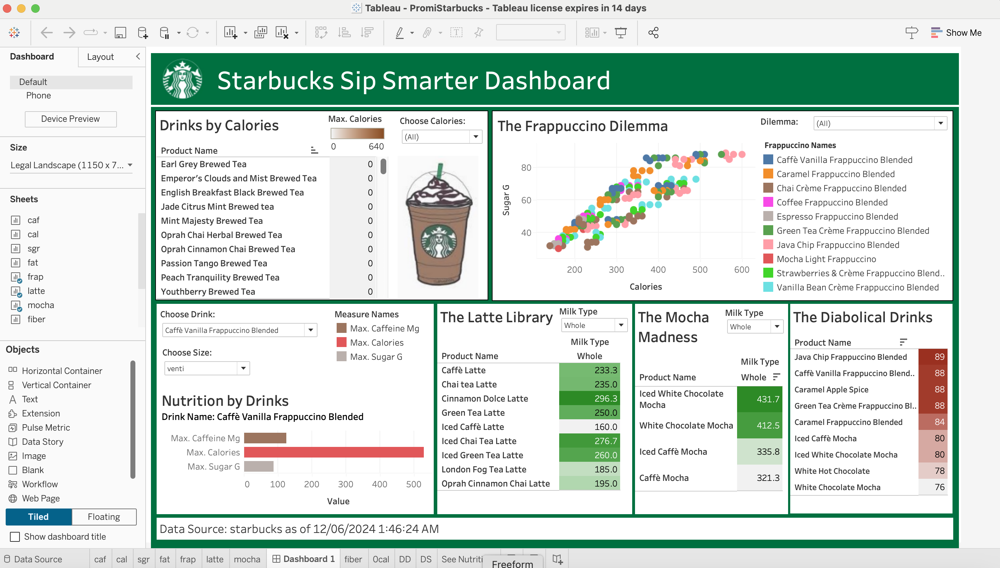

# Starbucks-Sip-Smarter-Dashboard

An interactive Tableau dashboard exploring the nutritional profile of Starbucks drinks,
designed to help people find drinks that fit their dietary goals!

## Features

### 1. Drinks by Calories
Filter all Starbucks drinks by calorie range to quickly find drinks that fit your daily intake goals.

### 2. 🧋 The Frappuccino Dilemma
A scatter plot showing all Frappuccinos plotted by **calories vs. sugar**, helping you 
spot which fraps are the worst offenders, and which ones you can get away with.

### 3. 🥤 Nutrition by Drinks
Select any drink from the dropdown and choose your size (tall, grande, venti) to see 
exactly how much **caffeine, calories, and sugar** you're consuming.

### 4. 🥛 The Latte Library
Explore how your **choice of milk** (whole, oat, almond, etc.) directly affects the 
calorie count of your latte. Small swaps, big difference.

### 5. ☕ The Mocha Madness
Same milk-type exploration applied to mochas. See how milk choices add or remove 
calories from your mocha order.

### 6. 💀 The Diabolical Drinks
A hall of shame for the most calorie and sugar-dense drinks on the menu. 
Because ordering a single coffee drink with **89 grams of sugar** is, frankly, diabolical!

## Dashboard Preview

## 🎨 Design Philosophy
Every design choice like colors, fonts, layout, and logo was intentionally matched to the official Starbucks brand identity, making the dashboard feel like a natural 
extension of the brand rather than a generic data viz achool project.

## 🛠️ Tools Used
- Tableau Desktop
- Data Source: Starbucks nutritional data (as of 12/06/2024)

## 🏆 Achievement
Earned more than full marks in the coursework for aestheic values, fun presentation and analytical depth of this dashboard!